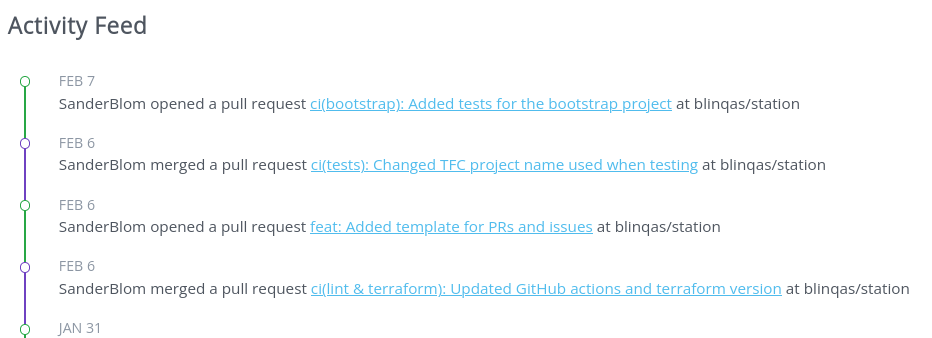

# github activity log
A basic REST API that can be used to retrieve data about github users. A visual example on how you can use the data or you webpage: 


## Background 
This was used as POC for a Wordpress Admin on how to store and visualize the github activity (PR only atm) for a dev team. The API could then be called from any website and provide the data with a low response time compared to querying the Github API directly.

## How to run

1. Clone repository 
2. Update the `USERNAMES` environment variable inside the `docker-compose.yaml` file and add the github usernames you want to monitor separated with a comma. Like so : `username1,username2,username3`. 
3. Run the application with `docker compose up` and go to `http://localhost:3000` to see the visual example or go to `http://localhost:3000/api/pr/` to get raw JSON data.

You can now query the API with postman, curl, etc like so: 

```
        curl localhost:3000/api/pr/ | jq
       
        {
            "title": "ci(bootstrap): Added tests for the bootstrap project",
            "url": "https://github.com/blinqas/station/pull/120",
            "createdAt": "2024-02-07T07:59:14Z",
            "user": "SanderBlom",
            "state": "open",
            "repoName": "station",
            "orgOrUserName": "blinqas",
            "merged": false
        },
        {
            "title": "ci(tests): Changed TFC project name used when testing",
            "url": "https://github.com/blinqas/station/pull/119",
            "createdAt": "2024-02-06T15:03:40Z",
            "user": "SanderBlom",
            "state": "closed",
            "repoName": "station",
            "orgOrUserName": "blinqas",
            "merged": true
        }
        .....
```

## Credits 

CSS for the example is mostly take from [JulienMelissas](https://codepen.io/JulienMelissas/pen/xbZdmz).